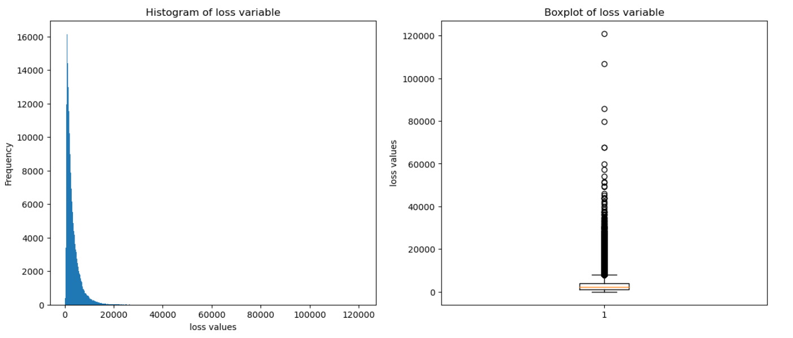
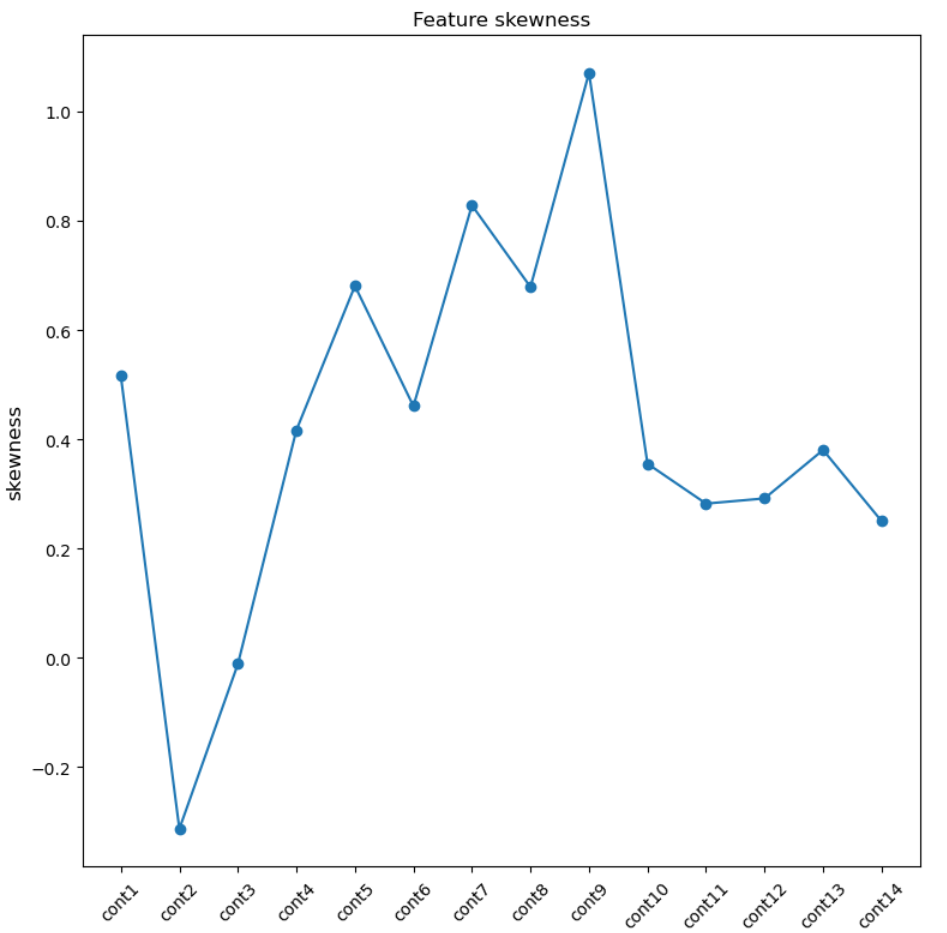
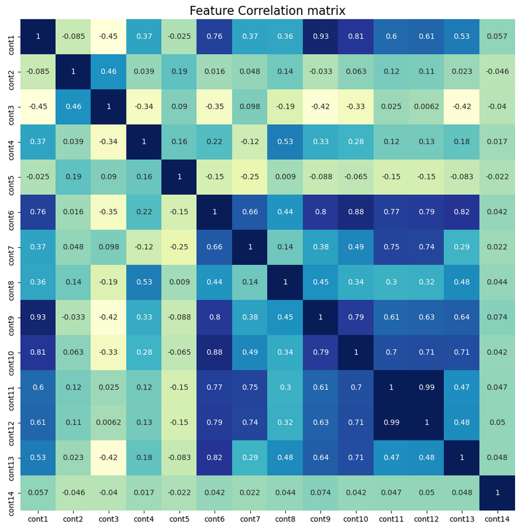
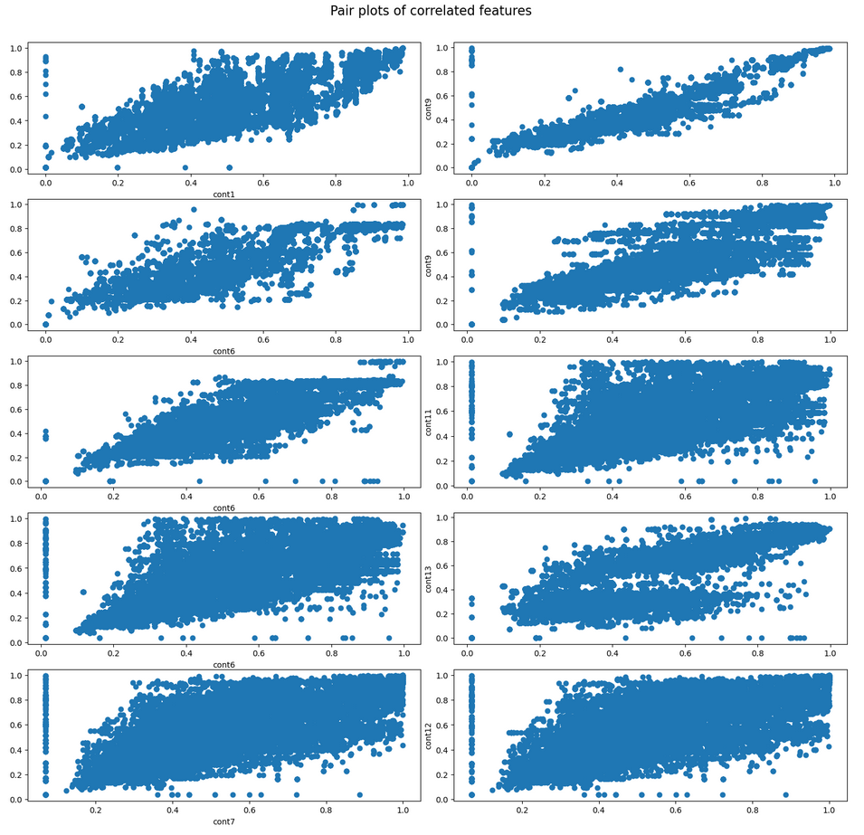
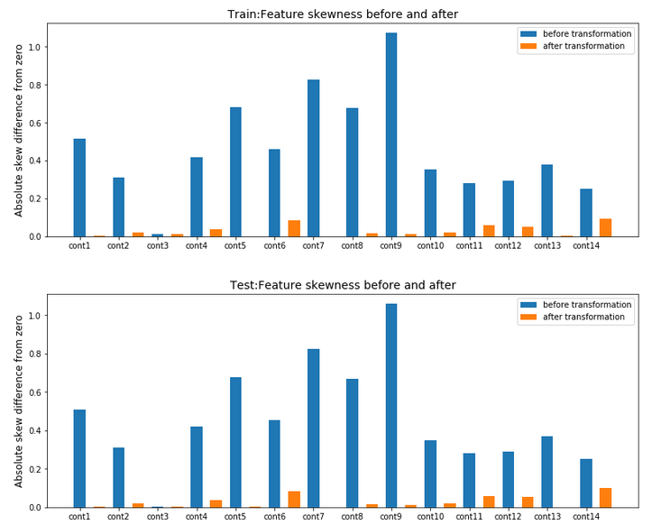
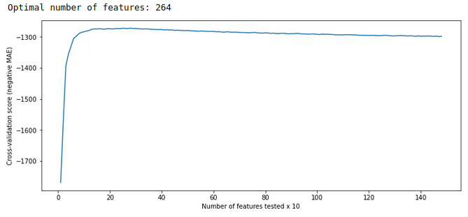

# Allstate-claim-severity-prediction

## Project Requirement:
Allstate is an personal insurance company in the United States. Predicting clients' claim severities are essential for insurance companies for their risk managements. This project is my first data science project where conduct several steps of the data science life cycle such EDA, Feature engineering, Feature selection, Machine learning models' performance analysis, etc.

## Files used in the project:
<ol>
  <li>EDA.ipynb</li>
  <li>feature-extraction.ipynb</li>
  <li>feature-selection.ipynb</li>
  <li>ML algo analysis.ipynb</li>
  <li>train-and-tune-on-selected-feat.ipynb</li>
</ol>

## Problem formulation and performance metric:
As the claims severity is a real valued feature this is a regression problem.

Mean Absolute Error (MAE): 

## Data Information:
<ul>
  <li>Total 130 predictor features</li>
  <li>Number of categorical features: 114
    <ul>
      <li>Number of binary features: 72</li>
      <li>Number of multi-variate features: 42</li>
    </ul>
  </li>
  <li>Number of numerical features: 16</li>
</ul>

## EDA:

The plot above shows right skewed target feature distribution. For regression we prefer bell shape curve of the target feature distribution.

Similar to the target feature distribution, most of the 14 numerical features exhibit skewness.

From the above matrix we can see many features highly correlated with each other.

The above plot shows pair plots of the correlated features with more thatn 70% correlation. Pair plots and correlation matrix shows collinearity among the continuous features. The effect of collinearity is reduced by subtracting one numerical feature from another who shows more than 70% of collinearty amongs each other.

## Feature scaling:

Skewness of the numerical features are reduced by applying appropriate feature transformations.

## Feature Engineering:
For the categorical features, various features were engineered based on the simple statics such as mean, standard deviation, probability of occurances, etc. Hence, in-total 1464 number of features were present after feature engineering step.

## Feature Elimination:
Using random forest regressor as an estimator recursive feature elimination with cross validation were performed to eliminate less effective features. This step reduced from 1464 number of features to just 264 features.

## Machine learning models:

|                  Model                  | Kaggle Score before Feature Extraction | Kaggle Score after Feature Extraction |
|-----------------------------------------|----------------------------------------|---------------------------------------|
|            Xgboost regressor            |                1255.57                 |                1153.21                |
|              Random Forest              |                1324.09                 |                1189.91                |
|              Neural Network             |                1268.66                 |                1226.69                |
|             Ridge regression            |                1314.69                 |                1229.35                |
| SGD with insensitive epsilon (SVR) loss |                1323.86                 |                1303.77                |
|          SGD with squared loss          |                1362.61                 |                1344.99                |
|           SGD with huber loss           |                1404.05                 |                1377.95                |
|  Random guess from normal distribution  |                2536.12                 |                2530.64                |
